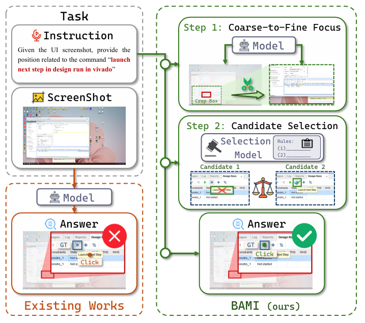

# BAMI: Training-Free Bias Mitigation in GUI Grounding

<div align="center">

**Borui Zhang\*, Bo Zhang\*, Bo Wang\*, Wenzhao Zheng, Yuhao Cheng, Liang Tang, Yiqiang Yan, Jie Zhou, Jiwen Lu†**

*Department of Automation, Tsinghua University; Lenovo*

<a href="asset/bami-v2.pdf"></a>
<a href="https://github.com/YourUsername/BAMI"></a>
<!-- <a href="#citation"></a> -->

</div>

---

## 📖 Introduction

This repository contains the official resources for the paper **"BAMI: Training-Free Bias Mitigation in GUI Grounding"**.

**BAMI** (Bias-Aware Manipulation Inference) is a novel, training-free framework designed to unlock the full potential of Multimodal Large Language Models (MLLMs) in GUI grounding tasks. By diagnosing grounding failures through our **Masked Prediction Distribution (MPD)** method, we identified two primary sources of error: **Precision Bias** (stemming from high resolution and discretization) and **Ambiguity Bias** (stemming from token-space edit distances).

BAMI addresses these issues via a structured inference process involving **Coarse-to-Fine Focus** and **Candidate Selection**, achieving state-of-the-art performance on benchmarks like **ScreenSpot-Pro** without requiring any additional model training.

<div align="center">
  
</div>

*Figure 1: Comparison with conventional grounding models. BAMI achieves accurate localization via structured inference with bias-aware manipulations.*

## 🔥 News
- **[2025-11-21]** The technical report is released! [Download PDF](asset/bami-v2.pdf).
- **[Coming Soon]** The inference code and evaluation scripts will be released soon. Stay tuned!

## 🚀 Key Features

* **Training-Free:** Directly boosts the performance of existing open-source backbones (e.g., OS-Atlas, UI-TARS, TianXi-Action) without fine-tuning.
* **Precision Bias Mitigation:** Implements a **Coarse-to-Fine Focus** strategy to handle high-resolution UI elements and small objects effectively.
* **Ambiguity Bias Correction:** Utilizes a **Candidate Selection** mechanism with Euclidean-space priors to correct MLLM selection biases.
* **Diagnostic Tool:** Introduces **MPD**, an attribution method to visualize and analyze error sources in GUI grounding.
* **SOTA Performance:** Achieves **57.8%** accuracy on the challenging ScreenSpot-Pro benchmark, outperforming baselines by a significant margin.

## 📊 Results

BAMI consistently improves accuracy across various model backbones and datasets.

| Model Backbone | Dataset | Baseline Accuracy | **BAMI Accuracy** |
| :--- | :--- | :---: | :---: |
| **TianXi-Action-7B** | ScreenSpot-Pro | 51.9% | **57.8%** |
| **UI-TARS-1.5-7B** | ScreenSpot-Pro | 40.8% | **51.9%** |
| **OS-Atlas-7B** | ScreenSpot-Pro | 18.9% | **41.6%** |

*For detailed experimental results, please refer to the [Technical Report](asset/bami-v2.pdf).*

## 🛠️ Usage

The code for BAMI is currently being organized and will be open-sourced shortly. We are cleaning up the scripts for the Masked Prediction Distribution (MPD) analysis and the inference pipeline to ensure ease of use.

## 📝 Citation

If you find this work helpful for your research, please consider citing our paper:
```bibtex
@article{zhang2025bami,
  title={BAMI: Training-Free Bias Mitigation in GUI Grounding},
  author={Zhang, Borui and Zhang, Bo and Wang, Bo and Zheng, Wenzhao and Cheng, Yuhao and Tang, Liang and Yan, Yiqiang and Zhou, Jie and Lu, Jiwen},
  journal={Technical Report},
  year={2025}
}
```